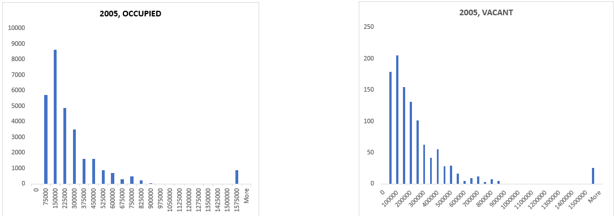
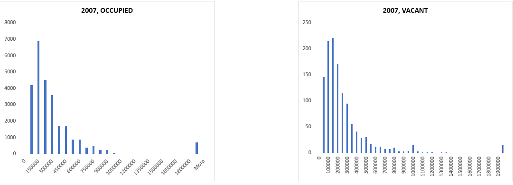
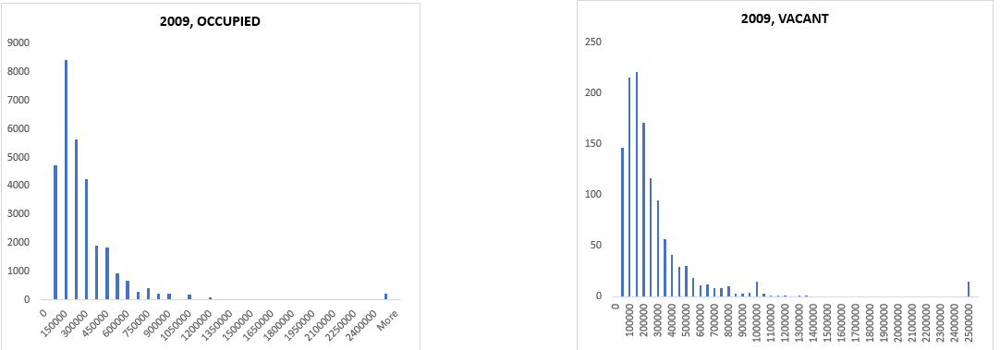
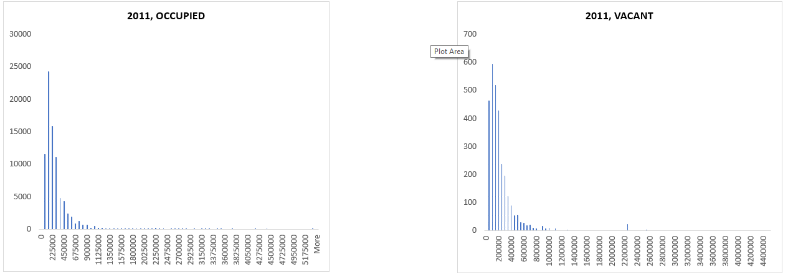
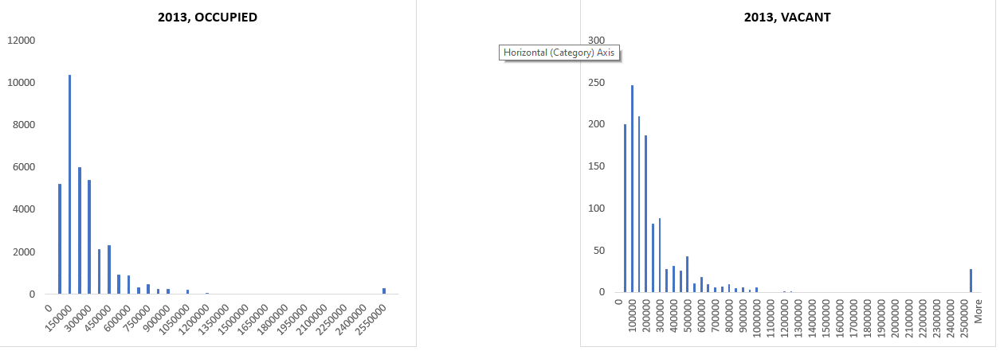
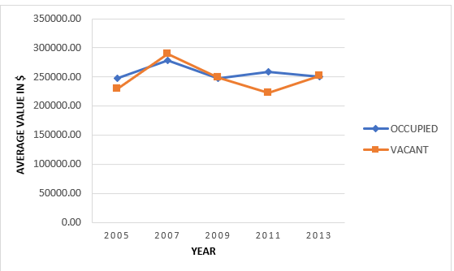
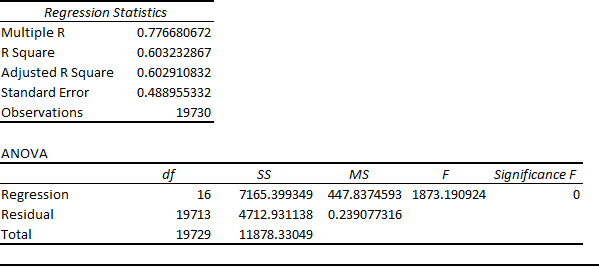
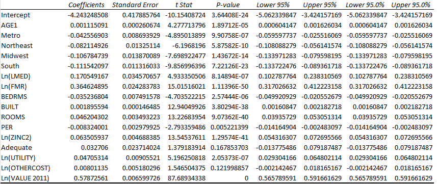

#  Coursera Business Statistics and Analysis
This project displays my skills in Statiscal Analysis, Regression Model in Excel and Data Storytelling

## Introduction

This is my capstone project for the **Coursera Business Statistics and Analysis**. This Excel project is statistical and prediction analysis of hosing units from US Department of Housing and Urban Development. The project is to analyze and derive insights to the crucial and make business decisions. 

## Probelm Statement
1. Test Difference in market value between **Occupied** and **Vacant** for housing units
3. Build a model for predicting market values for housing units.

## Skills Demostrated

The following Excel features were used
-Formulas
-Functions
-Visualizations
-Prediction analysis

## Data Source

The dataset is of different years  each year has its own data.The dataset consists of various housing units and their data, the variables in the data  are 
Region : region which the house is located
Bedrooms : number of bedrooms in the housing units.
Status: Occupied or Vacant
Value: current market value of a unit
This is the link of the full metadata [here](https://archives.huduser.gov/portal/datasets/hads.html)

## Data Descriptors

These are data descriptors for the project for **Occupied** and **Vacant**,it was recommended that we identify them.

## Analysis

### Market Value 

This is the distribtution of **Market value** across diiferent years between **Occupied** and **Vacant** housing units.

### Year 2005

### Year 2007

### Year 2009

### Year 2011

### Year 2013

### Growth in Market value 

This chart shows the growth in market value for both housing units

### T Test

Performed a paired t-test to determine the statistical significance of the variables.

### Regression Model

I built a regression model to predict **Market Value**. This is the Link to my submission file [here](https://coursera-assessments.s3.amazonaws.com/assessments/1699976690113/711d9871-15ef-4b4f-bf73-0c6f4d94096f/SUBMISSION%202.xlsx)

## Insights

- Difference in the Market Values is significant only for years 2005 and 2011. In these years the market value of **Occupied** units was greater than **Vacant** units.For the remaining years there is no significant difference in the market value across **Occupied** and **Vacant** units.
- The regression model now has a R-square of 0.60 since we added the Market Value for year 2011 as an additional 'X' variable.

